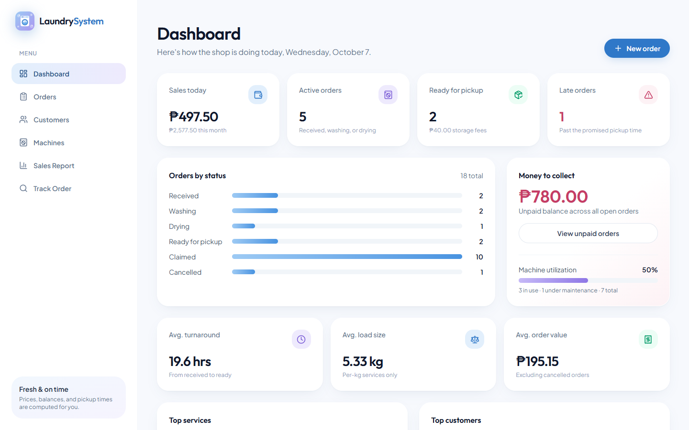
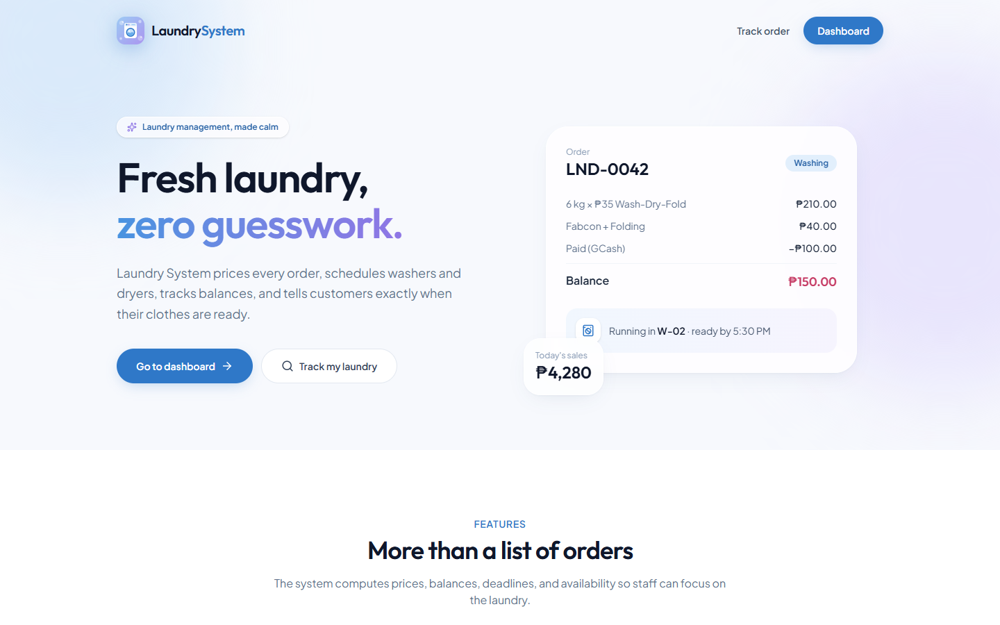
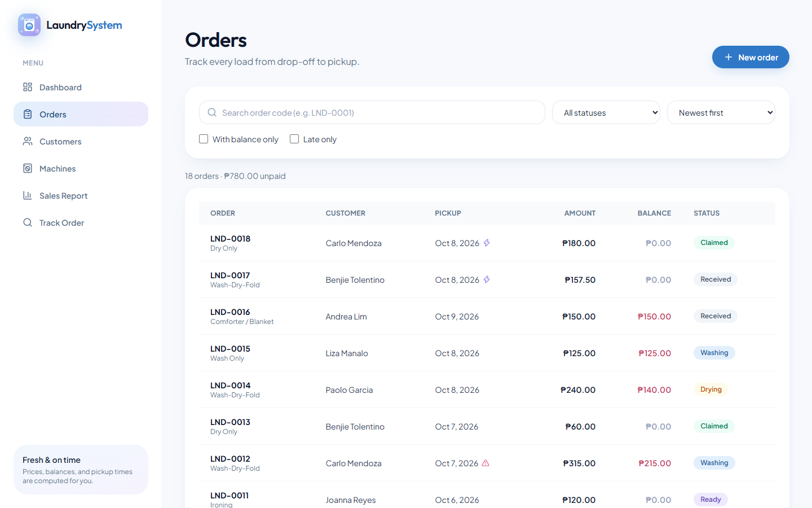
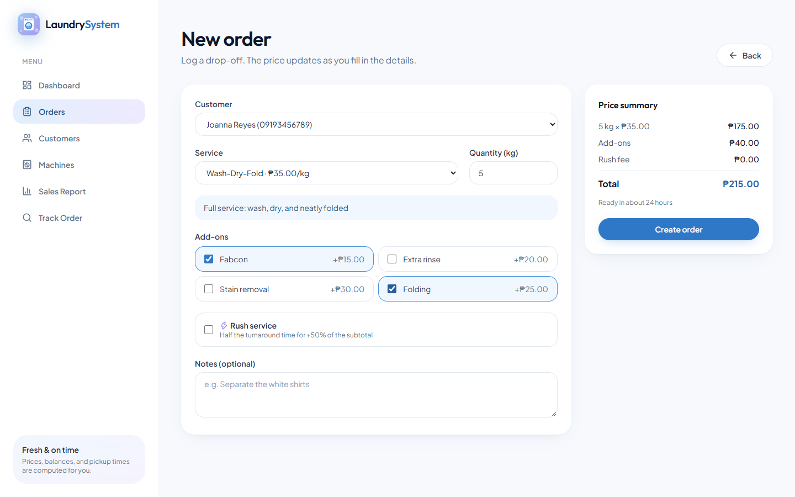
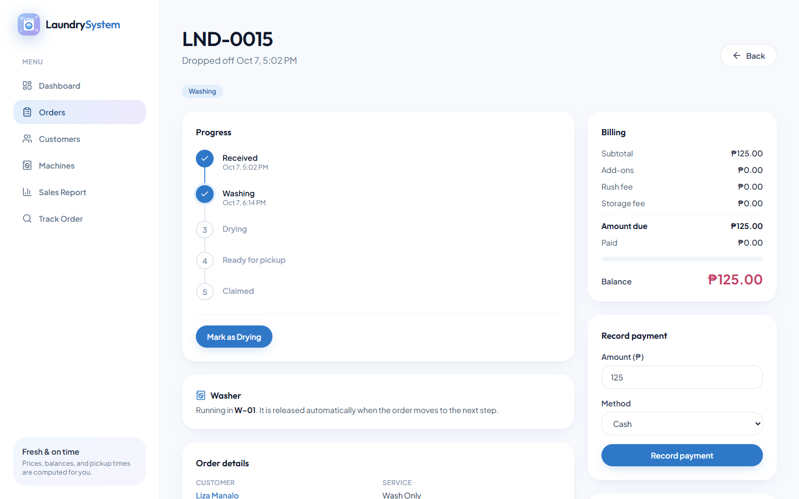
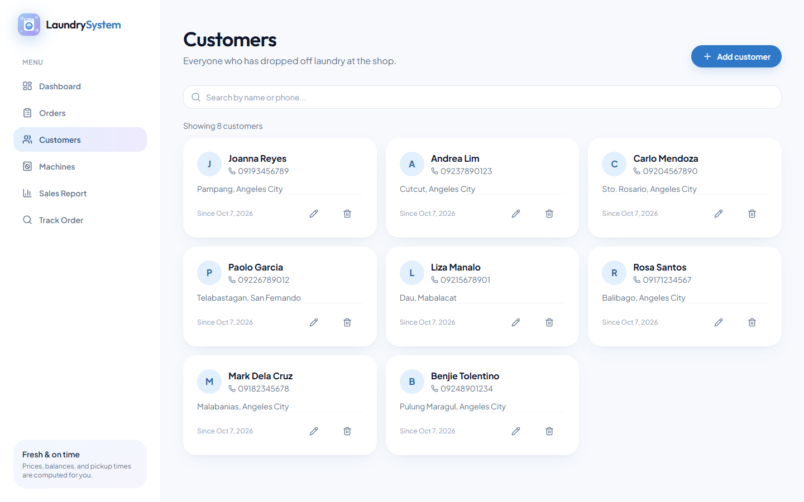
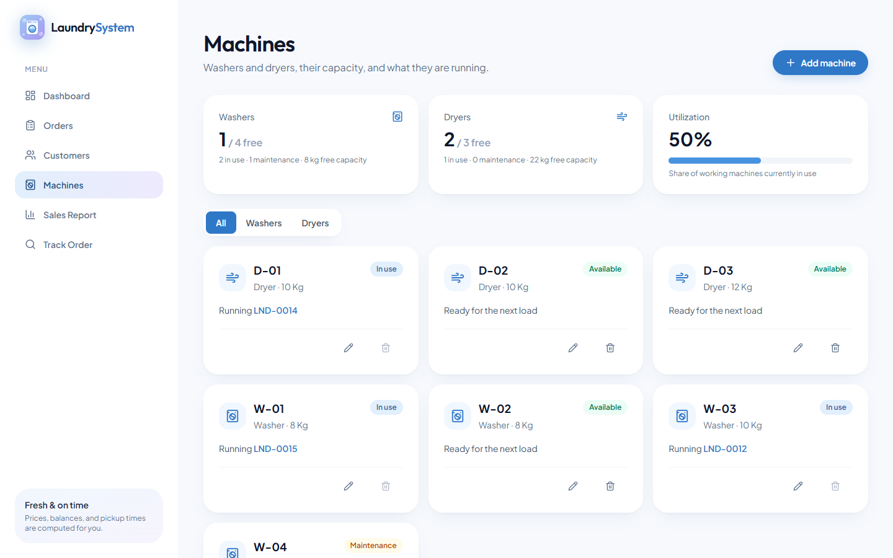
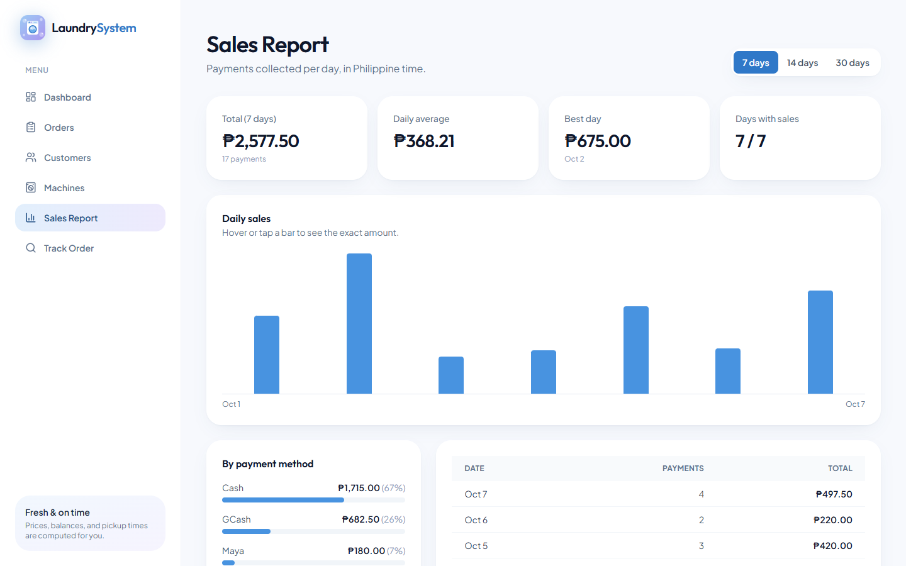
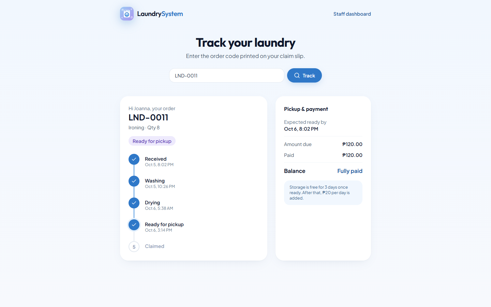
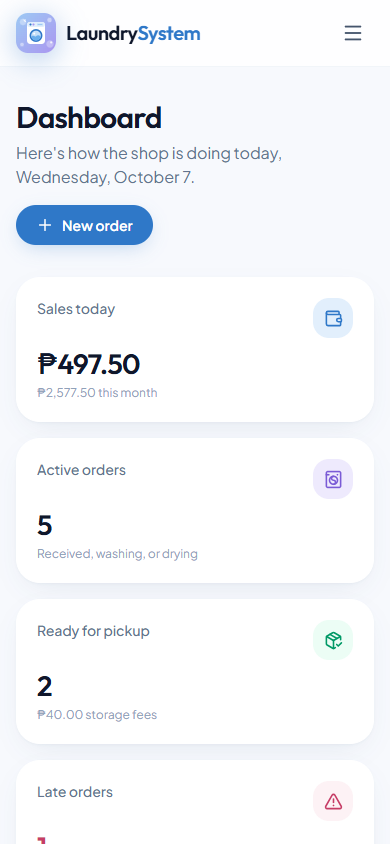

# Laundry System

A full-stack laundry shop management app. It tracks every load from drop-off to pickup: it prices orders, enforces status rules, assigns washers and dryers by capacity, keeps running balances, and lets customers check their order status with an order code.

**CTADWEBL – Advanced Web Programming · Final Project · A.Y. 2026–2027**



## Group members

| Member | GitHub | Role |
|---|---|---|
| [Full name] | [@Barcelona02](https://github.com/Barcelona02) | Backend: Express API, Mongoose models, business logic, seed data |
| Ian De Guzman | [@Letsbegin2](https://github.com/Letsbegin2) | Frontend: React pages, forms, design, API integration |

**Year & section:** [Year & Section]

## Concept

Small neighborhood laundry shops usually track loads on paper. Staff work out prices by hand, forget which machine is free, and customers keep asking whether their laundry is ready. Laundry System replaces that notebook. Staff log a drop-off, and the app computes the price, the promised pickup time, and the balance. It moves the order through a fixed sequence of steps and lets the customer look up their order online.

## What the application does and what data it processes

The app does more than store records. It **computes, derives, and enforces rules** on the data:

| Processing | How it works |
|---|---|
| **Pricing** | `price × quantity`, raised to the service's minimum charge, plus add-ons (fabcon ₱15, extra rinse ₱20, stain removal ₱30, folding ₱25) and a **rush fee** of +50% of the subtotal. |
| **Running balance** | `amount due = total + storage fee`; `balance = amount due − all payments`. Overpayments are rejected. |
| **Status transitions with rules** | `received → washing → drying → ready → claimed`. Steps cannot be skipped or reversed; only `received` orders can be cancelled or edited. An order cannot be **claimed** while it still has a balance. |
| **Date logic** | Promised pickup = now + service turnaround (halved for rush). Orders past their promised time are flagged **late**. Laundry left unclaimed for more than 3 days after it is ready earns a **₱20/day storage fee**. |
| **Availability & capacity** | Washers can only be assigned during `washing` and dryers during `drying`. The machine must be available and big enough for the load. Assignment is atomic to prevent **double-booking**, and the machine is released automatically on the next status change. |
| **Statistics** | Sales today, this month, and all time; orders by status; unpaid receivables; machine utilization; average turnaround, load size, and order value; top services and customers; daily sales series. |
| **Search, filter, sort** | Customers by name or phone. Orders by code, status, customer, unpaid, and late, and sorted by date, pickup time, balance, or amount. |

### Collections

| Collection | Key fields and rules |
|---|---|
| **Customer** | `name` (required, 2–100 chars), `phone` (required, **unique**, must match `09XXXXXXXXX`), `address`, `notes` |
| **Service** | `name` (unique), `pricingType` (enum `per_kg` / `per_piece`), `price` (min 1), `minimumCharge`, `turnaroundHours` (1–168), `isActive` |
| **Order** | `orderCode` (unique, `LND-0001`), `customer` → Customer, `service` → Service, `quantity` (0.5–100), `addOns` (enum), `isRush`, computed `subtotal / addOnsTotal / rushFee / totalAmount`, `status` (enum), `statusHistory[]`, `promisedAt`, `claimedAt`, `machine` → Machine |
| **Payment** | `order` → Order, `amount` (min 1), `method` (enum `cash` / `gcash` / `maya`), `reference` (required for GCash and Maya) |
| **Machine** | `code` (unique, `W-01` / `D-01`), `type` (enum `washer` / `dryer`), `capacityKg` (1–30), `status` (enum `available` / `in_use` / `maintenance`), `currentOrder` → Order |

All schemas use `{ timestamps: true }`.

## Screenshots

| Landing page | Orders |
|---|---|
|  |  |
| **New order with live price** | **Order detail: status, machine, payments** |
|  |  |
| **Customers** | **Machines** |
|  |  |
| **Sales report** | **Public order tracking** |
|  |  |

<p align="center"><br><em>Mobile view (390px)</em></p>

## Tech stack

| Layer | Technologies |
|---|---|
| Frontend | React 19 (Vite) + TypeScript, Tailwind CSS v4 (custom theme), React Router, React Hook Form + Zod, axios, lucide-react |
| Backend | Node.js, Express 5, Mongoose, dotenv, cors |
| Database | MongoDB Atlas |

## Project structure

```
laundry-system/
├── client/                 React frontend
│   └── src/
│       ├── api/            axios instance (axios.create + baseURL)
│       ├── components/     layout and reusable UI (Button, Card, ConfirmDialog, States...)
│       ├── context/        toast notifications
│       ├── hooks/          useFetch, useDebounce, useToast
│       ├── pages/          one file per route
│       ├── schemas/        Zod schemas (z.infer types)
│       ├── types/          TypeScript types matching the models
│       └── utils/          formatting and order rules
└── server/                 Express API
    ├── middleware/         logger, notFound (JSON 404), errorHandler
    ├── models/             Mongoose schemas
    ├── routes/             express.Router() per resource
    ├── seed/               sample data
    ├── utils/              pricing, balance, status, and date logic
    ├── app.js              configuration and route mounting only
    └── server.js           MongoDB connection and listen
```

## Setup

**Requirements:** Node.js 20 or newer and a MongoDB Atlas connection string.

### 1. Backend

```bash
cd server
npm install
cp .env.example .env     # then fill in MONGO_URI
npm run seed             # loads sample services, machines, customers, orders, payments
npm run dev              # http://localhost:5000
```

### 2. Frontend (in a second terminal)

```bash
cd client
npm install
npm run dev              # http://localhost:5173
```

The Vite dev server proxies `/api` to `http://localhost:5000`, so no frontend `.env` is needed for local development.

### Environment variables

| Variable | Where | Example | Purpose |
|---|---|---|---|
| `PORT` | `server/.env` | `5000` | Port of the Express server |
| `MONGO_URI` | `server/.env` | `mongodb+srv://<user>:<password>@<cluster>.mongodb.net/laundry` | MongoDB Atlas connection string |
| `CLIENT_URL` | `server/.env` | `http://localhost:5173` | Origin allowed by CORS |
| `VITE_API_URL` | `client/.env` (optional) | `https://api.example.com/api` | API base URL when not using the dev proxy |

`.env` is git-ignored; only `server/.env.example` is committed.

### Scripts

| Folder | Command | Description |
|---|---|---|
| server | `npm run dev` | Start the API with nodemon |
| server | `npm start` | Start the API with node |
| server | `npm run seed` | Clear and reseed the database |
| server | `npm run test:api` | Run the automated API test script |
| client | `npm run dev` | Start the Vite dev server |
| client | `npm run build` | Type-check and build for production |
| client | `npm run lint` | Run ESLint |

## API documentation

Base URL: `http://localhost:5000/api`. Errors always use the format `{ "message": "..." }` (validation errors also include an `errors` array).

### Status codes

| Code | When |
|---|---|
| `200` | Successful read, update, or delete |
| `201` | Record created |
| `400` | Validation error, invalid ID, duplicate value, or a broken business rule |
| `404` | Record or route not found |
| `500` | Unexpected server error |

### Endpoints

| Method | Path | Purpose | Sample request | Sample response |
|---|---|---|---|---|
| GET | `/health` | Server health check | – | `{ "status": "ok" }` |
| GET | `/customers` | List customers (`?search=` by name or phone) | `/customers?search=rosa` | `[{ "_id": "…", "name": "Rosa Santos", "phone": "09171234567" }]` |
| GET | `/customers/:id` | Get one customer | – | `{ "_id": "…", "name": "Rosa Santos", … }` |
| POST | `/customers` | Create a customer | `{ "name": "Grace Villanueva", "phone": "09351112233" }` | `201` `{ "_id": "…", "name": "Grace Villanueva", … }` |
| PUT | `/customers/:id` | Update a customer | `{ "address": "Anunas, Angeles City" }` | `{ "_id": "…", "address": "Anunas, Angeles City", … }` |
| DELETE | `/customers/:id` | Delete a customer (blocked if they have orders) | – | `{ "message": "Customer deleted" }` or `400` `{ "message": "Cannot delete customer with 2 order(s) on record" }` |
| GET | `/services` | List services (`?active=true`) | `/services?active=true` | `[{ "name": "Wash-Dry-Fold", "pricingType": "per_kg", "price": 35, "minimumCharge": 105, "turnaroundHours": 24 }]` |
| GET | `/orders` | List orders with computed balance (`?status=` `?customer=` `?search=` `?unpaid=true` `?late=true`) | `/orders?status=ready&unpaid=true` | `[{ "orderCode": "LND-0003", "status": "ready", "amountDue": 250, "amountPaid": 100, "balance": 150, "isLate": false }]` |
| GET | `/orders/:id` | Get one order with payments and balance | – | `{ "orderCode": "LND-0011", "totalAmount": 120, "storageFee": 0, "balance": 0, "payments": [ … ] }` |
| POST | `/orders` | Create an order; the server computes price, code, and pickup time | `{ "customer": "<id>", "service": "<id>", "quantity": 5, "addOns": ["fabcon", "folding"], "isRush": false }` | `201` `{ "orderCode": "LND-0018", "subtotal": 175, "addOnsTotal": 40, "rushFee": 0, "totalAmount": 215, "status": "received" }` |
| PUT | `/orders/:id` | Edit an order (only while `received`); price is recomputed | `{ "quantity": 8 }` | `{ "orderCode": "LND-0018", "subtotal": 280, "totalAmount": 320 }` |
| DELETE | `/orders/:id` | Delete a `received` or `cancelled` order without payments | – | `{ "message": "Order deleted" }` |
| PATCH | `/orders/:id/status` | Move to the next status (rule-based) | `{ "status": "washing" }` | `{ "status": "washing", "statusHistory": [ … ] }` or `400` `{ "message": "Cannot move from received to ready. Next allowed: washing, cancelled" }` |
| PATCH | `/orders/:id/machine` | Assign an available washer or dryer that fits the load | `{ "machine": "<machineId>" }` | `{ "machine": { "code": "W-02", "type": "washer" } }` or `400` `{ "message": "Order is washing, so it needs a washer, not a dryer" }` |
| GET | `/payments` | List payments (`?order=` `?method=`) | `/payments?method=gcash` | `[{ "amount": 100, "method": "gcash", "reference": "5551234", "order": { "orderCode": "LND-0011" } }]` |
| GET | `/payments/:id` | Get one payment | – | `{ "amount": 100, "method": "cash", "order": { "orderCode": "LND-0011" } }` |
| POST | `/payments` | Record a payment (no overpayment; GCash and Maya need a reference) | `{ "order": "<id>", "amount": 100, "method": "gcash", "reference": "5551234" }` | `201` `{ "payment": { … }, "amountDue": 215, "amountPaid": 100, "balance": 115, "isPaid": false }` |
| DELETE | `/payments/:id` | Remove a payment (not allowed once the order is claimed) | – | `{ "message": "Payment deleted" }` |
| GET | `/machines` | List machines (`?type=` `?status=`) | `/machines?type=washer&status=available` | `[{ "code": "W-02", "type": "washer", "capacityKg": 8, "status": "available" }]` |
| GET | `/machines/availability` | Free machines and capacity per type, utilization rate | – | `{ "washer": { "total": 4, "available": 1, "inUse": 2, "maintenance": 1, "availableCapacityKg": 8 }, "dryer": { … }, "utilizationRate": 50 }` |
| GET | `/machines/:id` | Get one machine | – | `{ "code": "W-01", "status": "in_use", "currentOrder": { "orderCode": "LND-0015" } }` |
| POST | `/machines` | Add a machine | `{ "code": "W-05", "type": "washer", "capacityKg": 8 }` | `201` `{ "code": "W-05", "status": "available", … }` |
| PUT | `/machines/:id` | Update a machine (status cannot change while in use) | `{ "status": "maintenance" }` | `{ "code": "W-05", "status": "maintenance", … }` |
| DELETE | `/machines/:id` | Delete a machine (not while in use) | – | `{ "message": "Machine deleted" }` |
| GET | `/stats/dashboard` | Sales, order counts, receivables, utilization, averages, top services and customers | – | `{ "sales": { "today": 317.5, "thisMonth": 2397.5 }, "orders": { "active": 5, "late": 1, "unclaimed": 2 }, "receivables": { "unpaidBalance": 780 }, … }` |
| GET | `/stats/sales` | Daily sales series in Philippine time (`?days=1–90`) | `/stats/sales?days=3` | `{ "days": 3, "total": 1137.5, "series": [{ "date": "2026-10-05", "total": 420, "payments": 3 }, …] }` |
| GET | `/track/:orderCode` | Public order lookup (first name only, no phone or address) | `/track/LND-0011` | `{ "orderCode": "LND-0011", "customerFirstName": "Joanna", "status": "ready", "amountDue": 120, "balance": 0 }` or `404` `{ "message": "No order found with code LND-9999" }` |

## Features

**Frontend (15 routes)**
- Landing page, dashboard, sales report, machines, and a public order tracking page
- Customers: searchable list, detail page with order history and computed totals, create and edit form
- Orders: filters (status, unpaid, late, code search) saved in the URL, sorting, and a new or edit form with a **live price preview** that uses the same formula as the server
- Order detail: progress timeline, rule-based status buttons, machine assignment filtered by capacity, and a payment form
- One axios instance for all API calls, plus a `useFetch` custom hook with loading, error, and retry states on every screen
- React Hook Form + Zod on every create and edit form (schemas outside components, `z.infer` types, per-field errors, disabled submit while saving)
- Confirmation dialog before every delete or irreversible status change, toast messages after create, update, and delete, and empty states for every list
- Custom Tailwind theme (sky, lavender, and rose palette), responsive from 375px to desktop

**Backend**
- 27 REST endpoints across 8 routers
- Custom request logger, JSON 404 catch-all, and a central error handler (validation, invalid ID, and duplicate key → 400)
- Business logic isolated in `server/utils/orderLogic.js`

## Known limitations

- No authentication. Any visitor can open the staff dashboard (not required for this project).
- Services are read-only in the API and UI; prices are managed through the seed script.
- Storage fees are computed when an order is read and are not stored, so changing the rules changes past balances.
- Order codes are generated from the latest code, so two orders created at the exact same moment could collide (the unique index rejects the second one).
- Sales are grouped by Philippine time (UTC+8) only.
- Not deployed. The app runs locally.
